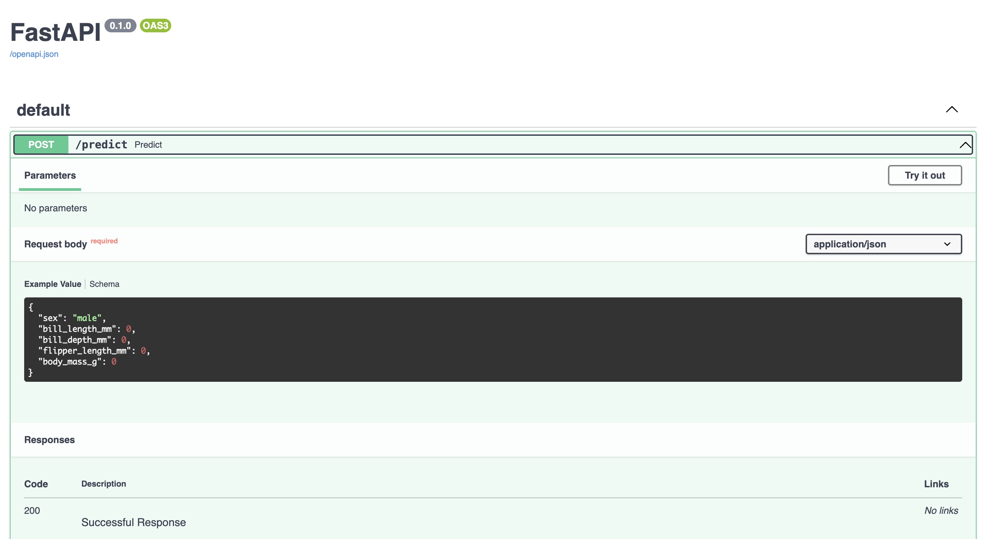

# Deploying an ML model with Docker and FastAPI

This repo is part of the MLOps Bootcamp initiative from Wizeline and Coecytjal.
The repo serves as a simple yet effective way of combining Docker container technology with the deployment process of a Machine Learning (ML) model.

### Repo's Objective
 - Build a simple ML model application with a trained model and expose the model for online inference with [Docker](https://www.docker.com) container and [FastAPI](https://fastapi.tiangolo.com/).


### Running the App

To build the Docker image:
```bash
docker build --tag ml_model_img .
``` 
To run the instance:
```bash
docker run --name ml_app --rm --publish 8000:8000 ml_model_img
```

To test the connection: 
```bash
curl localhost:8000
{"Hello":"World!"}
```

To try out the model for inferences, open your browser at [localhost:8000/docs](localhost:8000/docs). You should see the API documentation interface, provided by Fast API.

Click on the **Try it out** button and enter the input parameters to get a model inference.


